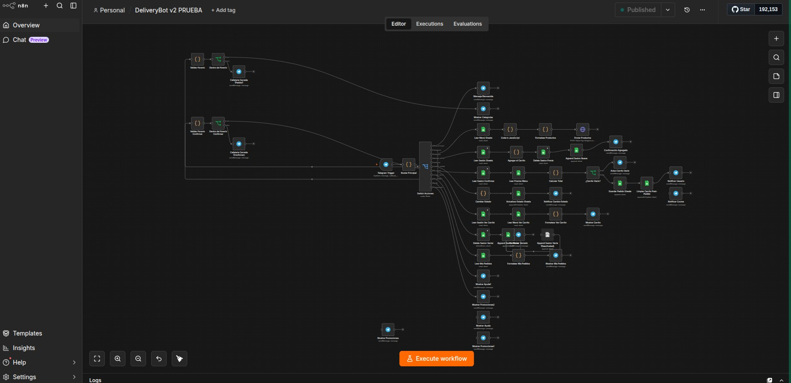
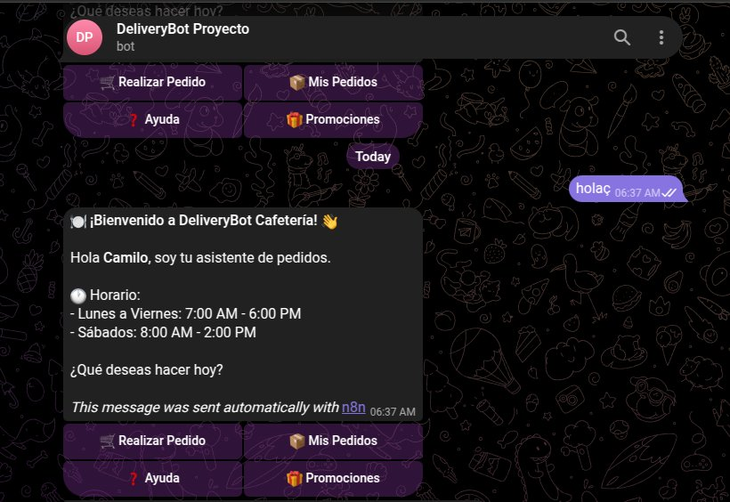
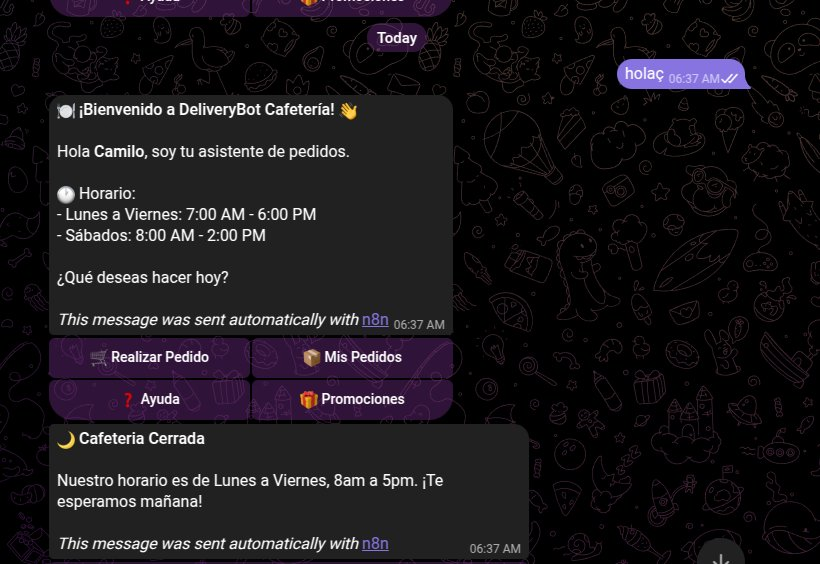
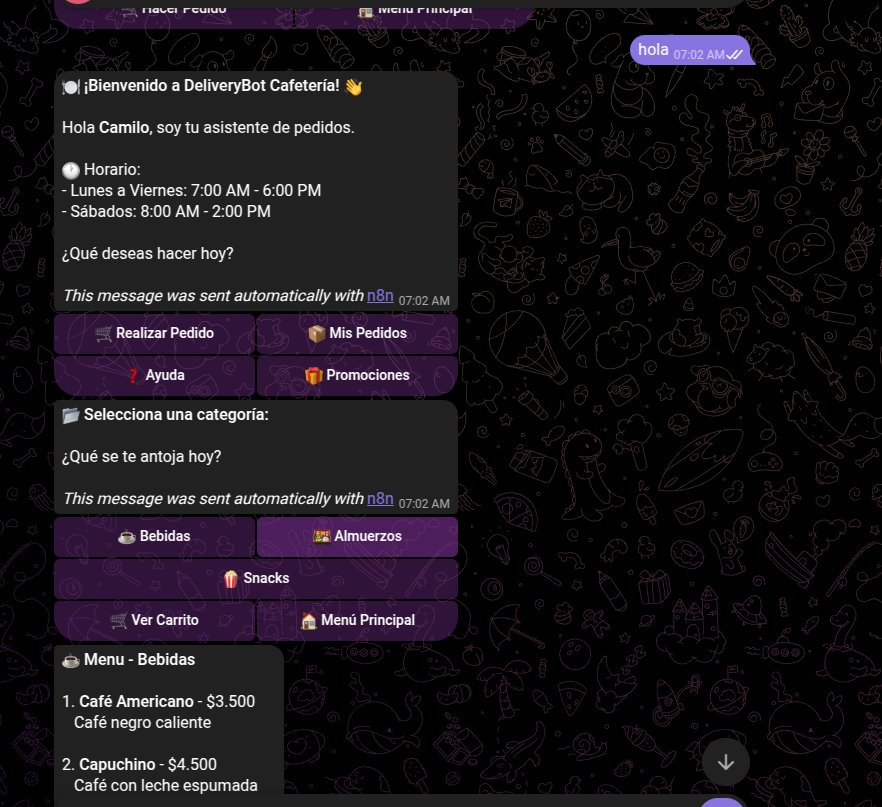
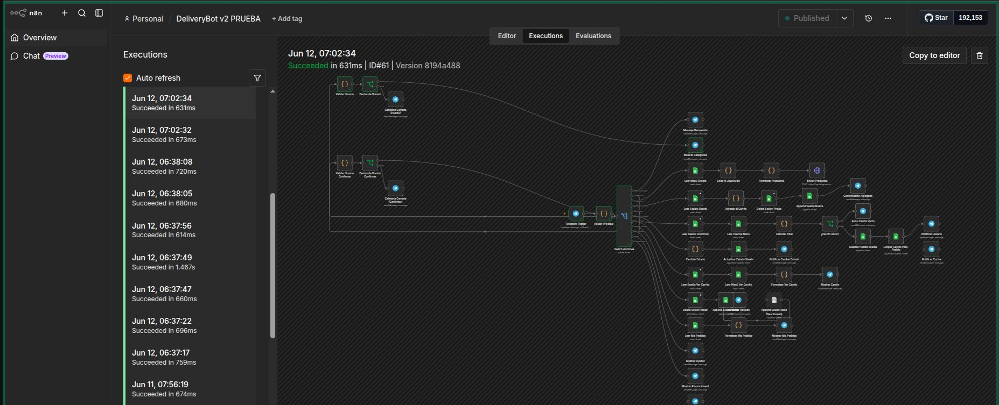

# DeliveryBot - Sistema de Pedidos para Cafetería (Telegram + n8n)

Bot de pedidos para cafetería construido con **n8n**, **Telegram Bot API** y **Google Sheets**, desplegado mediante **ngrok**.

## Stack

- n8n (workflow engine)
- Telegram Bot API (`@DeliveryBot_Sistema_bot`)
- Google Sheets (hojas: `MENU`, `SESSIONS`, `PEDIDOS`, `USUARIOS`)
- ngrok (exposición HTTPS del webhook)

## Funcionalidades base

- Menú de cafetería por categorías (Bebidas, Almuerzos, Snacks) leído desde Google Sheets
- Carrito de compras persistente por usuario (Google Sheets `SESSIONS`)
- Confirmación de pedido con registro en Google Sheets `PEDIDOS`
- Notificación a cocina y al usuario
- Seguimiento de estado del pedido (Recibido → En Preparación → En Camino → Entregado)
- Consulta de "Mis Pedidos", Ayuda y Promociones

---

## Update: Examen Control de Horarios de Atención

### Objetivo

Evitar que los usuarios confirmen pedidos cuando la cafetería está cerrada (por ejemplo, a las 11:00 PM), generando confusión en cocina al día siguiente.

### Horario de atención configurado

**Lunes a Viernes, de 8:00 AM a 5:00 PM.**

### Lógica implementada

1. **Nodo `Validar Horario` / `Validar Horario Confirmar` (Code/JavaScript):**
   Calculan la hora actual ajustada a zona horaria de Colombia (UTC-5), determinan el día de la semana y la hora decimal, y devuelven una propiedad booleana `abierto` (`true` si es Lunes–Viernes entre 8:00 AM y 5:00 PM, `false` en caso contrario).

2. **Nodo `Dentro de Horario` / `Dentro de Horario Confirmar` (IF):**
   Evalúan `{{ $json.abierto }}`. Según el resultado, enrutan el flujo por dos caminos distintos.

3. **Excepción — Consultar menú siempre disponible:**
   La acción **"Realizar Pedido"** (mostrar categorías y productos) **no está bloqueada** por el horario. Un usuario puede consultar el menú, ver categorías y armar su carrito en cualquier momento, incluso fuera de horario.

   - Si el usuario agrega un producto al carrito **fuera de horario**, el mensaje de confirmación ("✅ ¡Producto agregado al carrito!") incluye un recordatorio adicional:
     > 🌙 *Recordatorio:* Estamos fuera de horario de atención (Lun-Vie 8am-5pm). Puedes seguir armando tu carrito, pero la confirmación del pedido estará disponible cuando abramos.

4. **Bloqueo real — Confirmar Pedido:**
   La acción **"Confirmar Pedido"** pasa por `Validar Horario Confirmar` → `Dentro de Horario Confirmar`:
   - **Dentro de horario:** continúa el flujo normal (lee la sesión, calcula el total, guarda el pedido en `PEDIDOS`, notifica al usuario y a cocina, limpia el carrito).
   - **Fuera de horario:** el flujo se detiene y se envía el mensaje:
     > 🌙 *Cafetería Cerrada*
     >
     > No podemos confirmar pedidos en este momento.
     >
     > Nuestro horario de atención es de Lunes a Viernes, 8am a 5pm. ¡Te esperamos mañana!
     >
     > Puedes seguir consultando el menú y armar tu carrito, pero la confirmación estará disponible en horario de atención. Tu carrito quedó guardado.

   El carrito **no se pierde**: queda intacto en `SESSIONS` para que el usuario pueda confirmarlo al día siguiente dentro del horario.

### Nodos nuevos agregados al workflow

| Nodo | Tipo | Función |
|------|------|---------|
| `Validar Horario` | Code | Calcula si la cafetería está abierta (rama de pedido/categorías) |
| `Dentro de Horario` | IF | Enruta según el resultado de `Validar Horario` |
| `Cafeteria Cerrada (Pedido)` | Telegram | (Rama auxiliar, no bloquea consulta del menú) |
| `Validar Horario Confirmar` | Code | Calcula si la cafetería está abierta (rama de confirmación) |
| `Dentro de Horario Confirmar` | IF | Enruta según el resultado antes de confirmar el pedido |
| `Cafeteria Cerrada (Confirmar)` | Telegram | Envía el mensaje de cierre y detiene la confirmación |

### Corrección adicional: bug de carrito tras vaciar

Durante las pruebas se detectó que, tras usar "🗑 Vaciar Carrito", al agregar un nuevo producto este no se reflejaba correctamente en el carrito. Esto se debía a que el nodo `Limpiar Carrito` usaba la operación `appendOrUpdate` de Google Sheets, la cual genera inconsistencias de tipo (`telegram_id` como texto vs. número) entre filas.

**Solución:** se reemplazó por el mismo patrón **delete + append** ya usado en el flujo de "Agregar al Carrito" (`Delete Sesion Vaciar` → `Append Sesion Vaciar`), garantizando que la fila de sesión del usuario quede siempre consistente.

---

## Capturas de pantalla

### 1. Nodos nuevos en el canvas de n8n



### 2. Prueba en Telegram — Bot activo / mensaje de bienvenida



### 3. Prueba en Telegram — Mensaje de Cafetería Cerrada (fuera de horario)



### 4. Prueba en Telegram — Consulta de menú y categorías (dentro de horario)



### 5. Ejecución exitosa del workflow en n8n (Executions log)



---

## Despliegue

El workflow se despliega sobre **n8n** corriendo en un dispositivo Linux, usando **ngrok** para exponer el webhook de Telegram vía HTTPS. Variables de entorno necesarias al iniciar n8n:

```bash
export WEBHOOK_URL=https://<tu-url>.ngrok-free.dev
export N8N_EDITOR_BASE_URL=https://<tu-url>.ngrok-free.dev
n8n start
```

El archivo `DeliveryBot_v2_DEFINITIVO.json` contiene el workflow completo (44 nodos) listo para importar en n8n. Tras importarlo, es necesario reasignar manualmente las credenciales de **Telegram API** y **Google Sheets OAuth2** (los IDs de credencial no se exportan), y verificar que cada nodo de Google Sheets tenga seleccionada la hoja correcta (`MENU`, `SESSIONS`, `PEDIDOS`).
